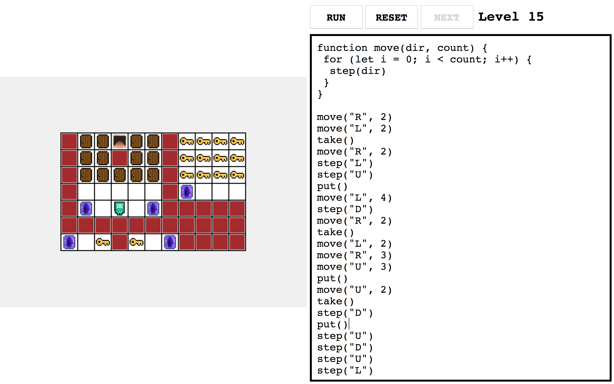
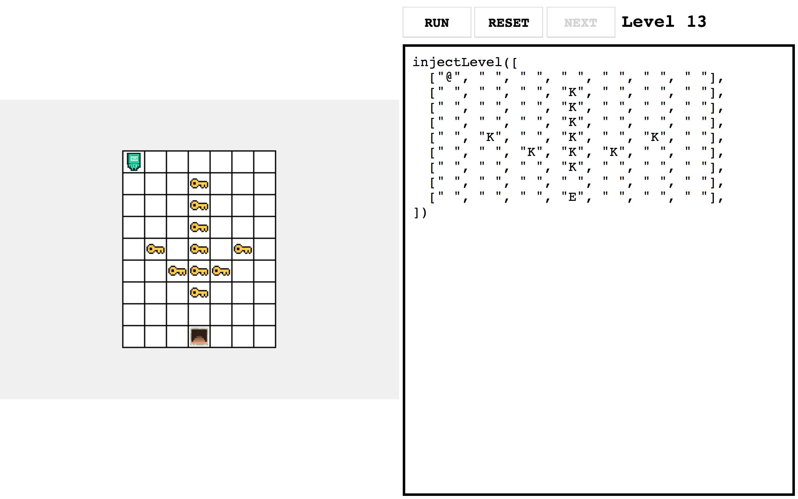

# gasb-workshop
Repository for the game programming workshop I led at Georgian-American School of Batumi in 2019

I taught them some javascript primitives and basic constructs which they used to play and ultimately change the game as they wished.

It should be available on my personal site at https://nika.ninja/workshop

All of the art is done by my brother:
https://twitter.com/corbyere

## Screenshots

### One of the harder levels

---

### Spiral level

---

### Level injection

Any level can be replaced a new one by calling `injectLevel` with a 2D array describing the level layout.

The kids had a lot of fun with this function.

---

## License

MIT (With the exception of the robot sprite, I do not own it so you can't redistribute that)
