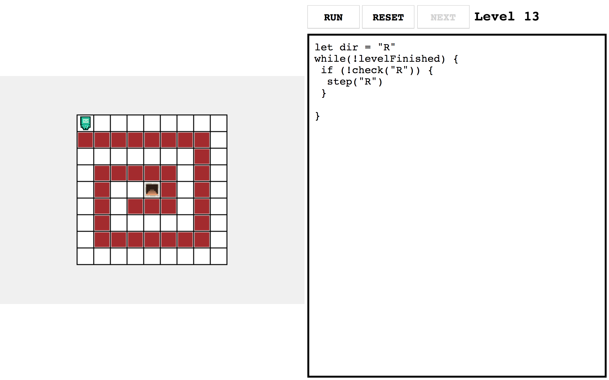

# gasb-workshop
Repository for the game programming workshop I led at Georgian-American School of Batumi in 2019

## Screenshots

### One of the harder levels

### Spiral level

### Levels can be injected at will by the players
The kids had a lot of fun with this function

